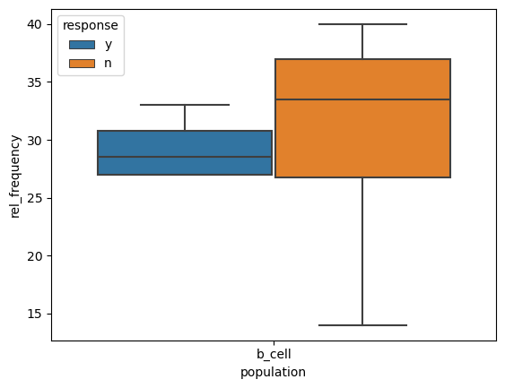
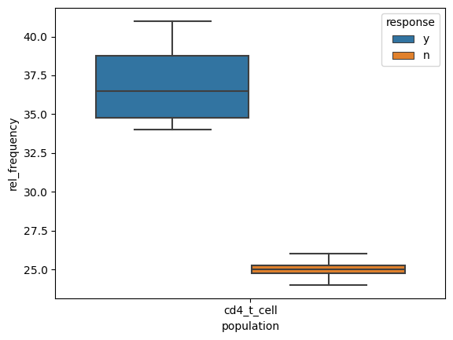
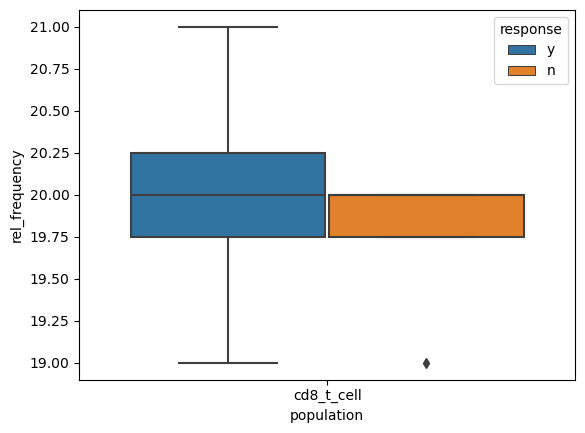
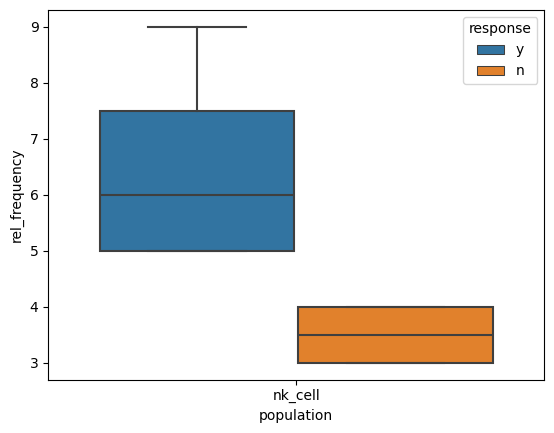
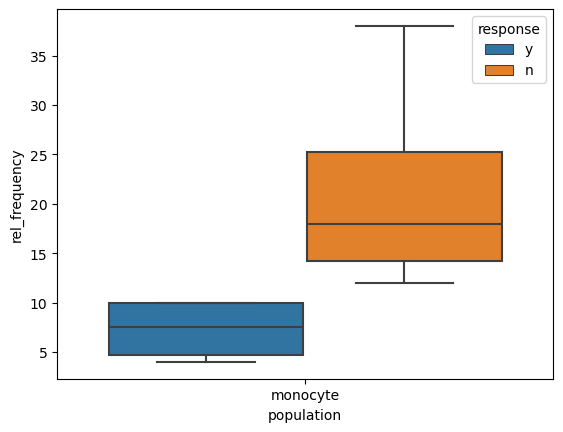
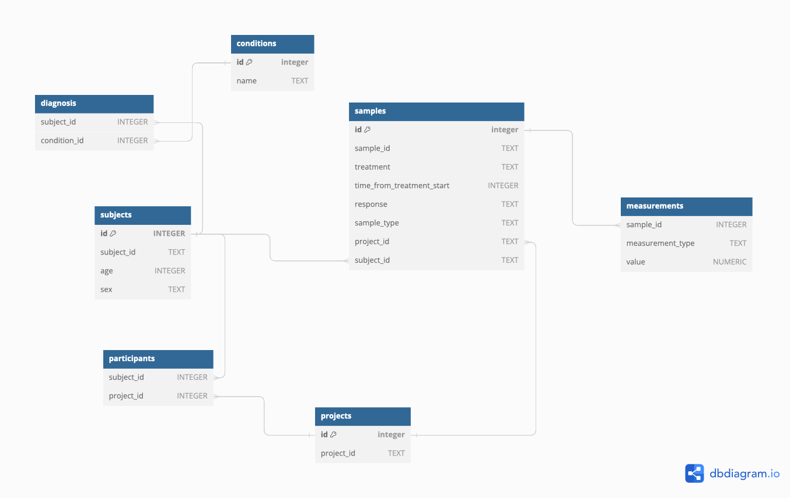

# Analysing Mass Cytometry data from clinical trials to identify biomarkers of response

## Environment setup

To run the code in this project, you need to set the environment as specified in the **environment.yml** file.
You need to have conda or mamba installed. (I prefer mamba as it is faster)
Make sure your current working directory is set to this project.

Create the environment and activate it:

`conda env create --file environment.yml`

`conda activate cytof`

## Data Analysis

The data wrangling, visualization and statistical analysis code can be found in **analysis_notebook.ipynb**

## Plots

1. B_cell Population in Responders vs Non-responders

2. CD4_T_cell Population in Responders vs Non-responders

3. CD8_T_Cell Population in Responders vs Non-responders

4. Natural Killer Cell Population in Responders vs Non-responders

5. Monocyte Population in Responders vs Non-responders

## Results

### At a significance level of 0.05

The relative frequencies of CD4 T-cells and Natural Killer cells show significant
differences between responders and non-responders. With both cell types being present
at higher proportions in responders.

### At a significance level of 0.1

Monocytes also warrant further consideration. Responders seem to have low-levels
of monocytes.

## Database to store Mass Cytometry and Clinical trials data

I have used sqlite to create a database called cytof.db
To connect to the database you can type `sqlite3 cytof.db` at the terminal.

### Schema

The schema of the database is available in the schema.sql file.
You can find the ER diagram [here](https://dbdiagram.io/d/6612f20303593b6b61675b8d)

Here is a summary of the schema:

1. There are a total of 5 entities
    * samples
    * subjects
    * projects
    * conditions
    * measurements
2. There are two junction tables
    * diagnosis - subject is diagnosed with conditions
    * participants - subject participates in these projects
3. It has the following indices
    * measurements_type_idx ON measurements (measurement_type)
    * measurements_sample_idx ON measurements (sample_id)
    * subjects_idx ON subjects (subject_id)
    * samples_project_idx ON samples (project_id)
    * samples_treatment_idx ON samples (treatment, sample_type, time_from_treatment_start, response)
    * participants_idx ON participants (project_id)
    * diagnosis_idx ON diagnosis (subject_id)

### Sample SQL queries

1. Connect to the database: `sqlite3 cytof.db` at the terminal
2. Copy paste the SQL queries from "queries.sql" file to get the results.

#### Query 1

|   name   | number_of_subjects |
|----------|--------------------|
| healthy  | 4                  |
| lung     | 3                  |
| melanoma | 6                  |

#### Query 2

| sample_id |
|-----------|
| s5        |
| s14       |
| s15       |
| s16       |
| s1        |
| s12       |
| s13       |
| s17       |

#### Query 3

| project_id | number_of_samples |
|------------|-------------------|
| 1          | 2                 |
| 2          | 4                 |
| 3          | 2                 |

#### Query 4

| response | number_of_samples |
|----------|-------------------|
| n        | 4                 |
| y        | 4                 |

#### Query 5

| sex | number_of_samples |
|-----|-------------------|
| F   | 4                 |
| M   | 4                 |
